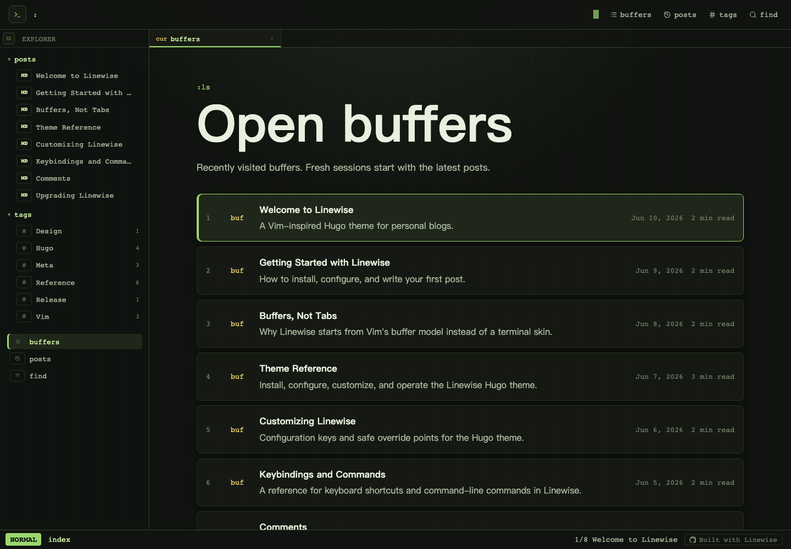

# Linewise

[](https://gohugo.io)
[](LICENSE)



Linewise is a Vim-inspired Hugo theme for personal blogs. Posts behave like buffers, search borrows from quickfix, and the interface uses Vim as an interaction model without sacrificing reading comfort.

**Demo and docs:** [linewise.tabsp.com](https://linewise.tabsp.com)

## Features

- Hugo theme installable as a git submodule or Hugo Module
- Markdown posts in `content/posts/`
- Tags, posts list, RSS, sitemap, canonical URLs, and Open Graph metadata
- Client-side search backed by `/search.json`
- giscus comments powered by GitHub Discussions
- Vim-like command palette, search palette, bufferline, file explorer, and statusline
- Keyboard motions for list navigation and reading
- Mobile file explorer drawer and horizontally scrollable buffer tabs

## Requirements

- Hugo Extended `0.146.0` or newer
- Go, if installing with Hugo Modules
- Node.js and pnpm only for Linewise theme development and Playwright tests

## Installation

Create a Hugo site:

```sh
hugo new site my-blog
cd my-blog
```

Then choose one installation mode.

### Git Submodule

```sh
git submodule add https://github.com/tabsp/linewise themes/linewise
```

```toml
baseURL = "https://example.com"
title = "My Blog"
locale = "en"
theme = "linewise"
```

### Hugo Module

```sh
hugo mod init github.com/you/my-blog
```

```toml
baseURL = "https://example.com"
title = "My Blog"
locale = "en"

[module]
[[module.imports]]
path = "github.com/tabsp/linewise"
```

Use one mode per site. Do not configure both `theme = "linewise"` and a Linewise module import.

## Configuration

Add the Linewise defaults to your site config:

```toml
[taxonomies]
tag = "tags"

[params.linewise]
description = "Notes from the command line."
author = "Your Name"
locale = "en"
favicon = "favicon.svg"
ogImage = "og.svg"
showExplorer = true
showBufferline = true

[params.linewise.comments]
provider = "none"

[outputs]
home = ["HTML", "RSS", "JSON"]

[outputFormats.JSON]
mediaType = "application/json"
baseName = "search"
isPlainText = true

[markup.highlight]
noClasses = false
```

Write posts in `content/posts/`:

```md
---
title: "Your Post Title"
description: "A short description for SEO and previews."
date: 2026-01-01
tags: ["notes"]
draft: false
---
```

Read the full documentation on the example site: [Theme Reference](https://linewise.tabsp.com/posts/theme-reference/).

## Development

```sh
pnpm install
pnpm dev
pnpm build
pnpm test
```

`pnpm dev` serves the example site at `http://localhost:4322/`.

## Project Layout

```text
archetypes/          Hugo archetypes
assets/              Theme CSS and TypeScript bundled by Hugo Pipes
exampleSite/         Example Hugo site
images/              Theme screenshots
layouts/             Hugo templates, partials, and shortcodes
static/              Theme-owned static assets
theme.toml           Hugo theme metadata
```

## License

MIT
